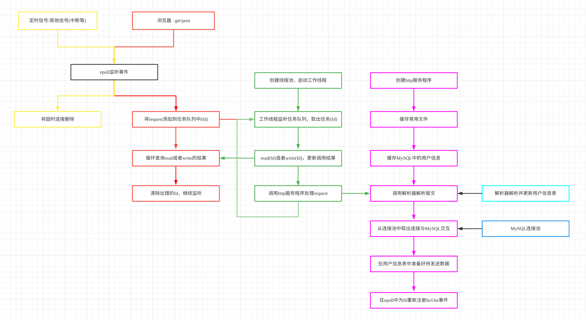
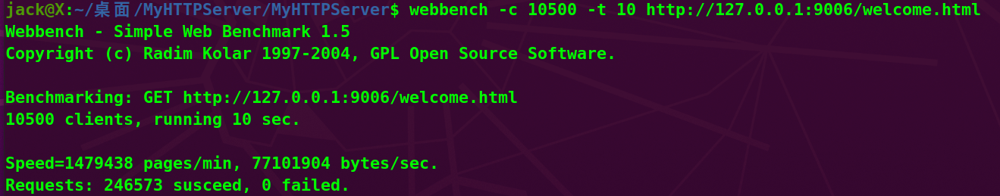

=======
# MyHTTPServer

#### 介绍
linux系统下的轻量级HTTP服务器。使用C++编写，可承受上万并发。

#### 说明
- 本项目基于**TCP/IP协议**，采用**半同步/半异步模式**以及**Reactor**事件处理模式作为框架。
- 使用**epoll统一事件源**监听socket，信号和定时事件。
- 使用**有限状态机**，并封装了一个**解析器**对http协议进行解析。
- 采用**线程池**和**MySQL连接池**技术提供高并发服务
- 利用**小根堆**构建**定时器**清理不活跃连接，提高资源利用率。
- 构建了轻量的**异步日志系统**，监测服务器状态。
- 实现了用户的**注册**和**登陆**功能，同时实现了向用户快速传输**文本文件**和**视频文件**的功能。
- 利用**webbench**测压，在**上万客户端并发连接10s**的情况下，达到约**20000TPS**。

#### 安装教程

1. 将代码克隆到本地
2. 安装Mysql数据库 
3. 初始化数据库
    1. 输入指令:`create database User;` 创建数据库
    2. 输入指令:`use User;` 定位到所创建的数据库中
    3. 输入指令:`create table user_data(name varchar(20) NULL, password varchar(30) NULL, email varchar(30) NULL)ENGINE=InnoDB;` 创建表

#### 使用说明

1. 在终端输入`./build`即可运行程序 
2. 日志文件在./Log/logs中，在做压力测试承载上万并发的时候会快速增大，单个文件最大约为**100mb**。
3. 不要轻易修改文件的层次，除非你对项目已有一定了解，能够修改一些有关路径的逻辑。
4. 本程序采用**守护进程**的形式运行，因此要杀死进程时需要手动调用`kill pid`，将运行时列出的进程id填入pid中。
5. 环境：ubuntu20.04 , MySQL8.0

#### 框架概览

#### 并发测试

#### 参与贡献
1.  Fork 本仓库
2.  新建 Feat_xxx 分支
3.  提交代码
4.  新建 Pull Request

#### 特技

1.  使用 Readme\_XXX.md 来支持不同的语言，例如 Readme\_en.md, Readme\_zh.md
2.  Gitee 官方博客 [blog.gitee.com](https://blog.gitee.com)
3.  你可以 [https://gitee.com/explore](https://gitee.com/explore) 这个地址来了解 Gitee 上的优秀开源项目
4.  [GVP](https://gitee.com/gvp) 全称是 Gitee 最有价值开源项目，是综合评定出的优秀开源项目
5.  Gitee 官方提供的使用手册 [https://gitee.com/help](https://gitee.com/help)
6.  Gitee 封面人物是一档用来展示 Gitee 会员风采的栏目 [https://gitee.com/gitee-stars/](https://gitee.com/gitee-stars/)
>>>>>>> 7f862054da4590b7f479e222f4b86527cde9de45
